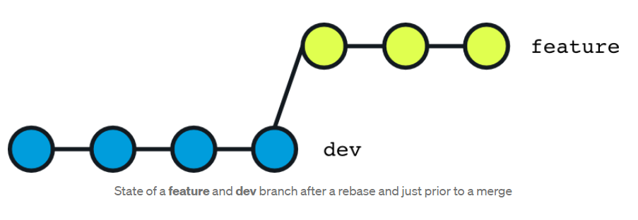
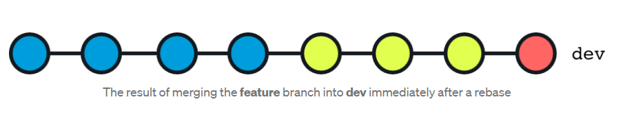
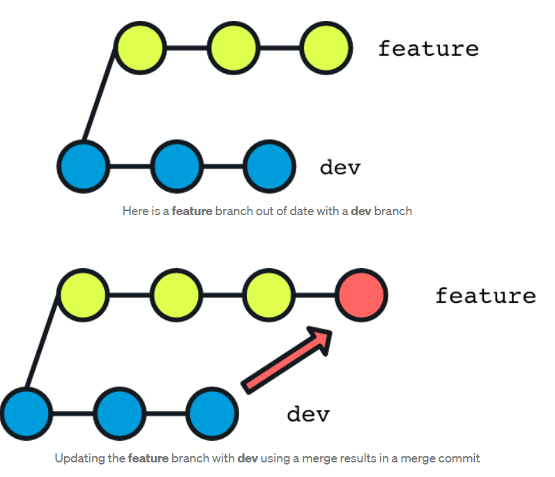
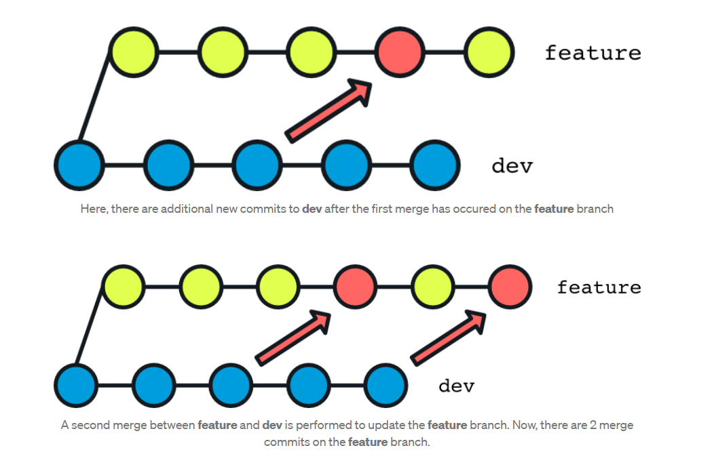
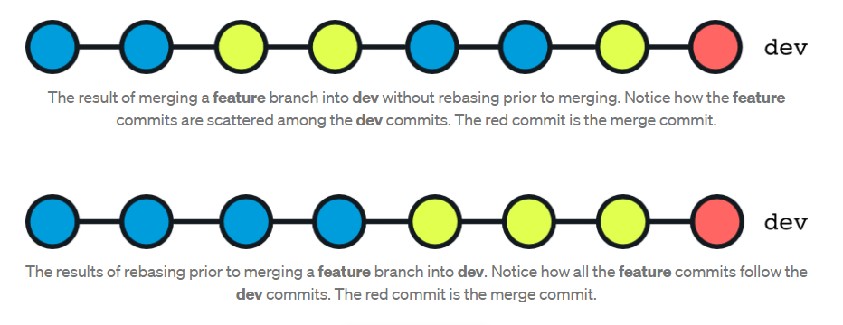

# 4. Branch advance

In chapitre 3, we have seen the basics of branch, now we need to use branch to help us to develop a project.

# 4.1 Bug fixing branch

Suppose you are working on dev branch, but there is a bug you need to fix. But your current work does not complete, and
you don't want to commit it. You can use below workflow

- Save changes to branch A.
- Run git stash.
- Check out branch B.
- Fix the bug in branch B.
- Commit and (optionally) push to remote.
- Check out branch A
- Run git stash pop to get your stashed changes back.
 

check below example

```shell
# go to dev branch
git checkout dev

# add below line in test/doc1.txt
# working on some thing, don't want to commit

# stash the current change
git stash

# create a new branch
git checkout -b fix/issue-101

# update the line "update to version 5" to "update to version 5 add some bug fixing code here"
# commit the change
git add test/doc1.txt 
git commit -m "fix bug for issue-101"

# go back to main branch and merge the branch fix/issue-101
git checkout main
git merge --no-ff -m "merge fix bug" fix/issue-101

# after merge you can delete the branch  
git branch -d fix/issue-101

# go back to dev branch
git checkout dev

# check the stash list
git stash list

# take the last stash on the list
git stash pop
```

## 4.2 Abandon an un commit branch

Sometime, you need to delete a branch that are not merged to the main.

Check below example

```shell
# create a new branch
git checkout -b feature/add_ai

# add a file and some code in it
# commit the change
git add test/add_ai.txt
git commit -m "add ai"

# go back to main
git checkout main

# delete the branch feature/add_ai
git branch -d feature/add_ai 

```

You should see below output

```text
error: The branch 'feature/add_ai' is not fully merged.
If you are sure you want to delete it, run 'git branch -D feature/add_ai'.
```

Git protects unmerged branch to be deleted. To force the deletion, you need to use option **-D**

```shell
git branch -D feature/add_ai
```

## 4.3 Work with remote branch

Working with remote branch, you need to download it or upload it.

```shell
# add a new branch 
git checkout -b feature/add_ai

# add some file and commit it
git add test/add_ai.txt 
git commit -m "add ai"

# push branch to remote server
git push origin feature/add_ai

# delete branch locally
git branch -D feature/add_ai

# as we have pushed it to remote server, we can get it back even after delete
# download branch from remote server to local
git checkout -b feature/add_ai origin/feature/add_ai
```

## 4.4 Handle conflict with remote server

To update your local branch, you need to do the following steps:
1. git push, if success end, if failed go step 2.
2. fetch the remote commit (git pull/git fetch)
3. merge the remote commit, if auto merge failed, you need to resolve the conflict
4. commit locally
5. push again

If you push to remote server failed, it means the remote branch has newer commit than you. 

Check below example

```shell
# push to remote
git push origin main

```

the command failed, you can see below output. This means the remote sever has newer commit than your local branch.

```text
To github.com:pengfei99/hello-github-actions.git
 ! [rejected]        main -> main (fetch first)
error: failed to push some refs to 'git@github.com:pengfei99/hello-github-actions.git'
hint: Updates were rejected because the remote contains work that you do
hint: not have locally. This is usually caused by another repository pushing
hint: to the same ref. You may want to first integrate the remote changes
hint: (e.g., 'git pull ...') before pushing again.
hint: See the 'Note about fast-forwards' in 'git push --help' for details.
```

Fetch the remote commit and merge it, the conflict file is shown below

```text
<<<<<<< HEAD
add some code in local
=======
add line from remote
>>>>>>> 13ffaac55ab072d64af54bf4679c924b37a8566c
```

As the conflict happens on the same branch, so instead of the branch name, git shows the commit id.

Resolve the conflict, and commit the result.

Then push again. You can notice this time it works.


Note if you do git pull, and you receive **no tracking information**. It means your local branch is not linked with 
remote branch. You need to run the below command to link them.

```shell
git branch --set-upstream-to <branch-name> origin/<branch-name>
```

## 4.5 Rebase

Rebasing is often used as an alternative to merging. Rebasing a branch updates one branch with another by applying 
the commits of one branch on top of the commits of another branch. For example, if working on a feature branch that 
is out of date with a dev branch, rebasing the feature branch onto dev will allow all the new commits from dev to be 
included in feature. Here’s what this looks like visually:


To achive above example, you can use below command. 

```shell
# rebase feature branch starting commit on the last commit of branch dev
# so all the recent changes of branch dev is included in feature branch. And no merge commit needed 
git rebase feature dev

# it's more common to run below command to do a rebase
git checkout feature
git rebase dev
```

### 4.5.1 Rebase on remote server or public branch is dangerous

**git rebase alters the commit history, so use it with care. If rebasing is done in the remote repository or public branch, 
then it can create a lot of issues when other developers try to pull the latest code changes from the remote repository. 
Remember to only run git rebase in a local repository.**

**All in one phrase, only rebase the branch that only you and you alone who is working on**

### 4.5.2 Typical Rebase Use Cases

#### 1. Updating a Feature Branch

The example we describe above is the most common use case of git rebase. We want to include new commits of dev branch
into our feature branch.

However, when you run the rebase command, there are some conflicts between the changes you made on feature and the 
new commits on dev. Thankfully, **the rebase process goes through each commit one at a time and so as soon as it 
notices a conflict on a commit, git will provide a message in the terminal outlining what files need to be resolved.
Once you’ve resolved the conflict, you git add your changes to the commit and run git rebase --continue to continue 
the rebase process.** If there are no more conflicts, you will have successfully rebased your feature branch onto dev.

#### 2. Updating a Feature Branch Prior to Merge

Let's retake the above example, this time we will do a merge after rebase. The feature branch after rebase is shown 
below:



Now we merge feature branch to dev

```shell
git checkout dev
git merge feature
```

Now, the dev branch looks like:



The historic of branch dev is linear, there is no parallel branch. Notice how all the commits from the feature 
branch are added to the end of the dev branch. This will always be the case if rebasing is immediately done prior 
to merging. The reason this happens is that **rebasing rewrites the git history and so the timestamp of the commits 
on the rebased branch will all be the moment at which the rebase command was run**. To be clear, rewriting history 
with **rebase recreates commits** that contain the same changes and commit message, but with a new hash and timestamp. 
Therefore, when merging a recently rebased feature branch into dev, **all the feature branch commits will be added at 
the end of dev since merging orders commits in chronological order.**

**Github allows to rebase and merge branches through their Pull Request interface**


#### 3. Renaming & Consolidating Commits in Feature Branches

Odds are, when nearing the completion of a feature in a feature branch, the commit history could be improved upon 
by renaming some commits to something more appropriate, combining closely related commits, and/or reordering commits 
in a more logical order. Rebasing allows for all of this!

Since **rebasing rewrites the git history, it provides some tools to specify exactly how to rewrite the history.** 
The best way to take advantage of these extra rebase features is by **running rebase in interactive mode by 
passing the -i flag with the command (i.e. git rebase -i feature dev)**.


When running an interactive rebase, a list of commits that will be rebased along with the word pick at the beginning 
of each commit message is presented in the default git editor configured on your machine 
(in my case it’s Visual Studio Code). The word pick can be changed with any of the following options 
(all of which are listed when running an interactive rebase):

```text
pick = use commit
reword = use commit, but edit the commit message
edit = use commit, but stop for amending
squash = use commit, but meld into previous commit
fixup = like "squash", but discard this commit's log message
exec = run command (the rest of the line) using shell
drop = remove commit
```

For the examples mentioned earlier here’s how you would tackle them:
- A commit message can be reworded using the reword option for a commit.
- Combining commits is done with the squash or fixup option on a commit that should be combined with another commit. 
  Ensure that the commit specified with squash/fixup immediately follows the commit with which it should be combined.
- Reordering commits is as simple as moving around the commit messages in the desired order.

### 4.5.3 Rebase advantage

#### 1. No Merge Commits
Merging two branches together always requires a merge commit. If a feature branch is continually being updated with a 
dev branch using a merge, there will be several merge commits resulting in a less clear git history.

For example, if we merge feature to dev first time. We will have below figure



If there are new commits in dev and feature branch, we need to merge again. After second merge, you will get below figure



These merge commits can be completely mitigated if rebase is used to update the feature branch instead of a merge.

#### 2. Linear & Sequential Git History

When rebasing a branch prior to a merge, all the feature branch commits are grouped together at the end of the dev 
branch whereas the feature branch commits are interspersed in the dev branch when a rebase is not used prior to merge. 
This is because merging orders commits chronologically. Grouping feature commits together, as is the case with a rebase, 
makes it simple to understand/analyze the git history afterwards.



#### 3. Simpler Time Resolving Conflicts

**When rebasing, git applies each commit one at a time and so conflicts can be resolved progressively**. When resolving 
conflicts for a merge, all conflicts must be resolved at once which can make it a bit more difficult to handle.


If a conflict is encountered while rebasing, git will indicate which files are conflicting and need to be modified. 
After changes have been made, the changes need to be staged to the commit and then the **rebase can resume using 
git rebase --continue. There is also the option of running git rebase --abort while resolving conflicts in a rebase**, 
which will cancel the rebase and leave the branch unchanged.

#### 4. Well Organized and Clean Git History

With all the benefits above in addition to the ability to change commit messages, combine commits, and reorder commits, 
rebasing makes for a very clean git history that is easy to understand. Having an understandable git history is great 
when trying to pinpoint when a certain feature or bug was introduced in your codebase.