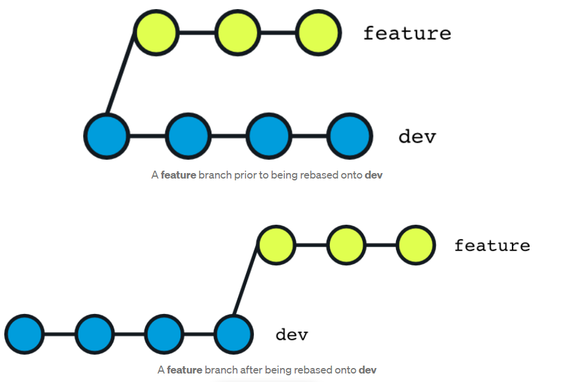

# 4. Branch advance

In chapitre 3, we have seen the basics of branch, now we need to use branch to help us to develop a project.

# 4.1 Bug fixing branch

Suppose you are working on dev branch, but there is a bug you need to fix. But your current work does not complete, and
you don't want to commit it. You can use below workflow

- Save changes to branch A.
- Run git stash.
- Check out branch B.
- Fix the bug in branch B.
- Commit and (optionally) push to remote.
- Check out branch A
- Run git stash pop to get your stashed changes back.
 

check below example

```shell
# go to dev branch
git checkout dev

# add below line in test/doc1.txt
# working on some thing, don't want to commit

# stash the current change
git stash

# create a new branch
git checkout -b fix/issue-101

# update the line "update to version 5" to "update to version 5 add some bug fixing code here"
# commit the change
git add test/doc1.txt 
git commit -m "fix bug for issue-101"

# go back to main branch and merge the branch fix/issue-101
git checkout main
git merge --no-ff -m "merge fix bug" fix/issue-101

# after merge you can delete the branch  
git branch -d fix/issue-101

# go back to dev branch
git checkout dev

# check the stash list
git stash list

# take the last stash on the list
git stash pop
```

## 4.2 Abandon an un commit branch

Sometime, you need to delete a branch that are not merged to the main.

Check below example

```shell
# create a new branch
git checkout -b feature/add_ai

# add a file and some code in it
# commit the change
git add test/add_ai.txt
git commit -m "add ai"

# go back to main
git checkout main

# delete the branch feature/add_ai
git branch -d feature/add_ai 

```

You should see below output

```text
error: The branch 'feature/add_ai' is not fully merged.
If you are sure you want to delete it, run 'git branch -D feature/add_ai'.
```

Git protects unmerged branch to be deleted. To force the deletion, you need to use option **-D**

```shell
git branch -D feature/add_ai
```

## 4.3 Work with remote branch

Working with remote branch, you need to download it or upload it.

```shell
# add a new branch 
git checkout -b feature/add_ai

# add some file and commit it
git add test/add_ai.txt 
git commit -m "add ai"

# push branch to remote server
git push origin feature/add_ai

# delete branch locally
git branch -D feature/add_ai

# as we have pushed it to remote server, we can get it back even after delete
# download branch from remote server to local
git checkout -b feature/add_ai origin/feature/add_ai
```

## 4.4 Handle conflict with remote server

To update your local branch, you need to do the following steps:
1. git push, if success end, if failed go step 2.
2. fetch the remote commit (git pull/git fetch)
3. merge the remote commit, if auto merge failed, you need to resolve the conflict
4. commit locally
5. push again

If you push to remote server failed, it means the remote branch has newer commit than you. 

Check below example

```shell
# push to remote
git push origin main

```

the command failed, you can see below output. This means the remote sever has newer commit than your local branch.

```text
To github.com:pengfei99/hello-github-actions.git
 ! [rejected]        main -> main (fetch first)
error: failed to push some refs to 'git@github.com:pengfei99/hello-github-actions.git'
hint: Updates were rejected because the remote contains work that you do
hint: not have locally. This is usually caused by another repository pushing
hint: to the same ref. You may want to first integrate the remote changes
hint: (e.g., 'git pull ...') before pushing again.
hint: See the 'Note about fast-forwards' in 'git push --help' for details.
```

Fetch the remote commit and merge it, the conflict file is shown below

```text
<<<<<<< HEAD
add some code in local
=======
add line from remote
>>>>>>> 13ffaac55ab072d64af54bf4679c924b37a8566c
```

As the conflict happens on the same branch, so instead of the branch name, git shows the commit id.

Resolve the conflict, and commit the result.

Then push again. You can notice this time it works.


Note if you do git pull, and you receive **no tracking information**. It means your local branch is not linked with 
remote branch. You need to run the below command to link them.

```shell
git branch --set-upstream-to <branch-name> origin/<branch-name>
```

## 4.5 Rebase

Rebasing is often used as an alternative to merging. Rebasing a branch updates one branch with another by applying 
the commits of one branch on top of the commits of another branch. For example, if working on a feature branch that 
is out of date with a dev branch, rebasing the feature branch onto dev will allow all the new commits from dev to be 
included in feature. Here’s what this looks like visually:



To achive above example, you can use below command. 

```shell
# rebase feature branch starting commit on the last commit of branch dev
# so all the recent changes of branch dev is included in feature branch. And no merge commit needed 
git rebase feature dev

# it's more common to run below command to do a rebase
git checkout feature
git rebase dev
```

### 4.5.1 Rebase on remote server is dangerous

**git rebase alters the commit history, so use it with care. If rebasing is done in the remote repository, 
then it can create a lot of issues when other developers try to pull the latest code changes from the remote repository. 
Remember to only run git rebase in a local repository.**

### 4.5.2 Typical Rebase Use Cases

#### Updating a Feature Branch

The example we describe above is the most common use case of git rebase. We want to include new commits of dev branch
into our feature branch.

However, when you run the rebase command, there are some conflicts between the changes you made on feature and the 
new commits on dev. Thankfully, **the rebase process goes through each commit one at a time and so as soon as it 
notices a conflict on a commit, git will provide a message in the terminal outlining what files need to be resolved.
Once you’ve resolved the conflict, you git add your changes to the commit and run git rebase --continue to continue 
the rebase process.** If there are no more conflicts, you will have successfully rebased your feature branch onto dev.

#### Updating a Feature Branch Prior to Merge

