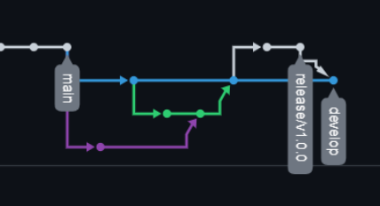

# 6. Git flow

In 2010, **Vincent Driessen** presented Git Flow. Since then, many developers have adopted it. So massively, 
that he recently wrote a note in his original post. He thought valuable to urge developers to consider this workflow 
only if you must deal with several versions in production.

If you fit into that category, I still consider Git Flow to be the most reliable workflow.


## 6.1 The Core Branches

When you create a Git repository, it comes along with a **master/main** branch. That's your most sensitive branch ever. 
It's a snapshot of what you deliver in production.

To move forward between two releases, you must create a develop branch. That's where you'll pour all your ongoing work. 
You must never merge directly into master. So to begin with, create and switch to the develop branch. Let's commit once 
for illustration purpose:

```shell
git checkout -b develop
git commit -am "First commit on develop"
git push -u origin develop
```

Note: The -u option while pushing is only required the first time you push your branch to the remote repository.

## 6.2 Setup your develop branch

During your project’s lifecycle, you’ll develop features to improve your product. For each feature you should start a
new feature branch, **the branch name should be prefixed with feature/<feature_name>**.

```shell
git checkout -b develop
```

### 6.2.1 Feature branch 
For example, suppose we want to add a new feature dataviz. 

```shell
git checkout -b feature/data_viz

# add some file with code, then commit them
git commit -m "add feature data viz"

# then push feature branch to remote
git push origin feature/data_viz
```
Repeat the commit and push process till you’ve finished your feature. **After that, create a Pull Request of the 
feature branch to develop branch on GitHub **. Make sure your feature branch is mergeable to develop branch. 

If not, **I encourage you to rebase your branch on develop en continue mode**. So you can resolve conflict with develop
branch one commit (develop branch) a time. If you are not familiar with rebase, go check chapter 04.branch_advance.
or you can just follow these steps:
- Check out your branch you want to rebase.
- Update your local repository.
- Rebase your branch onto the desired branch.
- Fix potential conflicts.
- Ensure your tree is correct.
- Push your local branch

Finally, merge your branch when both your teammates and your CI allows it.

If you don’t use the GitHub interface to merge your branch, you can always do it from the CLI.

```shell
git checkout develop
git merge --no-ff origin feature/data_viz
```

With the --no-ff option, there will be no merge commit created, which makes the git historic more clean. This is also
the default setup of github.com pull request.

After remote pull request, to update your local develop branch, you need to git pull from remote develop branch

```shell
git pull origin develop
```

Note you can delete the feature branch after you merge the feature to develop branch

```shell
# local
git branch -d feature/data_viz

# remote
git push -d origin feature/data_viz
```


## 6.3 Release branch

Suppose you are ready to release a version of your product. Now you need to create a release branch for it.

Go back to develop branch, and create a release branch from develop branch, since that's your most up-to-date branch. 
Name it with the app version name — let's say 1.0.0.

```shell
git checkout -b release/v1.0.0
```

Remember to bump your version in your code and commit this change

```shell
# add version number to your code and commit
git commit -m "Bump version to 1.0.0"

[release/v1.0.0 e589229] Bump version to 1.0.0
 1 file changed, 2 insertions(+)

```

**Note that the release branch should only contain bugfix branches. You don't want to deliver a new feature while 
you're about to ship a new version.**


## 6.4 Finish release
As soon as you ship the release to your users, you can merge your release branch into master(or main). Either create a Pull 
request targeting master/main or do it on the CLI

```shell
git checkout main
git merge --no-ff origin release/v1.0.0
```

Then mark the head of main with a tag v1.0.0.

```shell
git tag v1.0.0
git push --tags
```

Now before deleting your release branch, you must **merge all the bugs you've fixed into develop**. First, merge develop 
into release to solve your potential conflicts.

```shell
git checkout release/v1.0.0
git merge --no-ff origin develop
```

In the official Git Flow guide, the back merge is directly performed from develop. I'd recommend doing the extra steps 
above for two reasons:
- You should never push directly to develop
- It’s always beneficial to assess the back merge’s correctness from a Pull Request. You’ll want a set of eyes to 
  prevent mistakes.

After you pushed your release, the tree should looks like




## 6.5 Patch Your Release

Let’s face it; your application will suffer from bugs in production. Sometimes, some are too critical to wait 
for the next release. You’ll need to react fast and deliver an unexpected release that fixes the issue. Create a 
hotfix branch from master. Let's name it 1.0.1 by using the PATCH number I mentioned above.

After that, you’ll do the same you did for a release branch:
1. Merge hotfix into master
2. Tag your hotfix
3. Merge develop into hotfix
4. Fix potential conflicts on hotfix
5. Merge hotfix into develop
6. Delete hotfix
With these steps, you have the complete tree you could get:

After you merged the hot fix, your tree should looks like:


